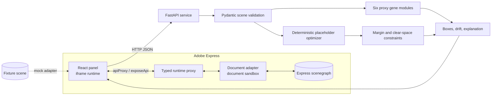

# Architecture

## Runtime boundary

Adobe Express uses two isolated runtimes. React, `fetch`, and status visualization live in the iframe. The Express Document SDK is imported only by `src/documentSandbox/code.ts`; that runtime exposes serializable typed functions to the iframe. The shared boundary intentionally uses plain objects and arrays supported by Adobe's communication layer.

The UI attempts to connect to the Adobe UI SDK at runtime. If it cannot, the document client chooses the fixture adapter and displays a persistent Mock mode banner. Solver calls are identical in both modes.

## Data path

1. The sandbox traverses the active page and emits schema `1.0.0` normalized geometry.
2. The iframe sends the scene to `/fingerprint` or `/optimize`.
3. Pydantic rejects incompatible or malformed scenes before computation.
4. The placeholder solver returns target-normalized boxes, drift metrics, and recorded explanation steps.
5. The sandbox creates a new target page and applies boxes to matching cloned nodes. Node cloning is not in this initial skeleton, so missing IDs are surfaced explicitly.

The API shape is designed to survive replacement of the placeholder internals by a PyTorch renderer and optimizer.

